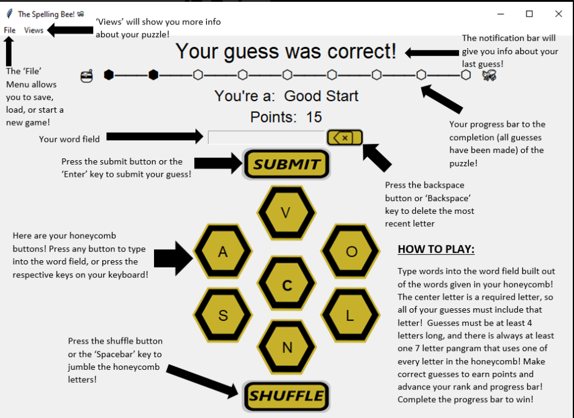

## 2023sp-420-SNEK
## Spelling Bee - SNEK

## Description

    -A Spelling Bee game, implemented in Python with an SQLite database


<p align="center">
          
</p>

### Contributers

<p align="center">
    
</p>

### Neccessary Libraries

* Libraries not pre-packaged with Python
that need installation.

    * setuptools
    * colorama
    * requests
    * numpy
    * pandas
    * pytest
    * pytest-cov
    * pillow
    * Prompt-Toolkit


### Python Version

    Tested on Python 3.10.9 and Python 3.11.1


### Instructions for Building using Setup

0. when using windows, execution policy for scripts must be changed
    from default to allow scripts to run like the activate script for the
    virtual environment. This is done by using the command 
    (Set-ExecutionPolicy -ExecutionPolicy RemoteSigned)

1. Creating and entering a virtual environment
    * Creating the environment:
    
        * Linux/Mac:  ```python3 -m venv spell```
        * Windows:  ```py -m venv spell```
        
    * Activating/Entering the environement:
    
        * Linux/Mac:  ```source spell/bin/activate```
        
        * Windows:
            * CMD:  ```spell\Scripts\activate```
            * PowerShell:  ```spell/Scripts/activate```
            
    * Deactivating/Exiting the environment:
    
        * Linux/Mac/PowerShell:  ```deactivate```

2. Building
    * Within the spell environment use the command:  ```pip install -e .```

3. Running program
    * Within the spell environment:
    
        * GUI:   ```bee```
        * CLI:   ```bee --cli```


### CLI Instructions

    How to play:
    You are given a word puzzle with a bunch of letters
    and a required letter.  The Required letter is in the
    center of the honeycomb.  Every word that you guess
    requires that the center letter be used, otherwise you
    will not receive credit for the guess.  The word that
    you guess also needs to be a valid word in the
    Scrabble dictionary.  Every puzzle has a corresponding
    pangram that it is generated from.  The pangram will
    include every letter in the honeycomb.

    Commands:
    Call commands with a preceeding '!'. Commands may be
    called at anytime.

            -!new rnd - Generate a new random puzzle
            -!new wrd - Genereate a new puzzle with a user given
                        word.  Console will prompt for the word after
                        command is given.
            -!status - Display you status for the current puzzle.
            -!save - Bring up the prompts for saving your current game.
            -!load - Bring up the prompts for loading a saved game.
            -!shuffle - Shuffle the shown puzzle honeycomb randomly, changing
                        the order of the letter randomly other than the 
                        required center letter.  You can use this to
                        help you find other words.
            -!guessed - Shows all the already correctly guessed words.
            -!hints - prints out all the hints for the given puzzle
            -!help - Prints out the help menu.
            -!exit - Exits the game. Will prompt to save.
            -!quit - Exits the entire program. Will prompt to save.'''
   
### GUI Instructions

<p align=center>
    
<p>

### Testing Suite

* Using the Testing Suite

* Running a complete Test:
    * Use the command line command:  ```btest``` or ```btest all```
        * To add coverage use:  ```btest cov``` or ```btest all cov```

* Testing coverage of a specific directory (IE. model, controller, view)
    * Use the command line command:  ```btest model``` or ```btest controller``` or ```btest view```

* Testing individual files and unit test
    * ```btest file``` for normal testing
    * ```btest file cov``` for testing with coverage
    * ```btest file single``` for testing one individual unit test from the file
        * Choose the test file via the number connected to them (IE. 1, 2, 3, etc.)
        * If you do not want to choose a file:  ```quit```

    
 ### Design patterns
    * MVC: The MVC pattern can be seen in the division of responsabilities,
    being the classes in charge of showing data in the view (UserInterface and the different 
    classes that inherit from it), the classes in charge of controlling the flow of the
    program and responding to the user interactions in the controller part, and
    the classes in charge of storing and handling data in the model. 
    All these classes are divided into their corresponding folders
    
    * Proxy: For calling the data base, we have implemented the proxy design pattern, 
    in order to have only one class to communicate with it. This can be useful to prevent
    IO problems when accessing the data in the data base. The class that acts as a proxy
    for the data base is the DataSource class, which has an interface that can be used
    to extract data without directly interacting with the data base.
    
    * Factory: For creating the different types of interfaces, we have a factory class 
    that returns the object of one of the classes that inherit from UserInterface, depending
    on the type of interface the user has chosen to use. The class that makes the object is
    just called factory, and its use can be seen in the main.py when creating the interface
    for the user.
    
    * Singleton: As we have made clear that we want to control the access to the data 
    base in order to avoid different problems that can happen due to multiple components
    accessing it, a logical improvement to avoid this problem is to, not only have different
    classes accessing the data base but have different objects, that is why the DataSource
    class, the proxy for the data base, is now a singleton. This can be seen in the beginning
    of the DataSource class, as only one instance of that class can be made.

    * Strategy: Saving data in both plain text and cipher text (for the wordList) is 
    seperated into different strategies using the strategy design pattern. This seperates 
    our save data function which originally did everything in house, into different stratgies 
    so we can save json files in both plain text and cipher text without having the complexity
    stored in the single saveData function. This can be seen with our new classes Context, 
    Strategy, plainSave and encryptSave. They are first used in saveData based on if the user 
    is encrypting their wordList or not.

    * Iterator:
    
    PS:
    
     * Mediator: The communication between the different components is not direct, 
    it is always through the controller. If the interface wants some data about the
    puzzle, it won't call directly to the puzzle, but it will ask to the controller
    about that data. Even though this pattern is a consequence of the MVC, we wanted
    to at least mention it.
        
        
            


### And Remember
    
#  ***`No Step On Snek`*** 

        

