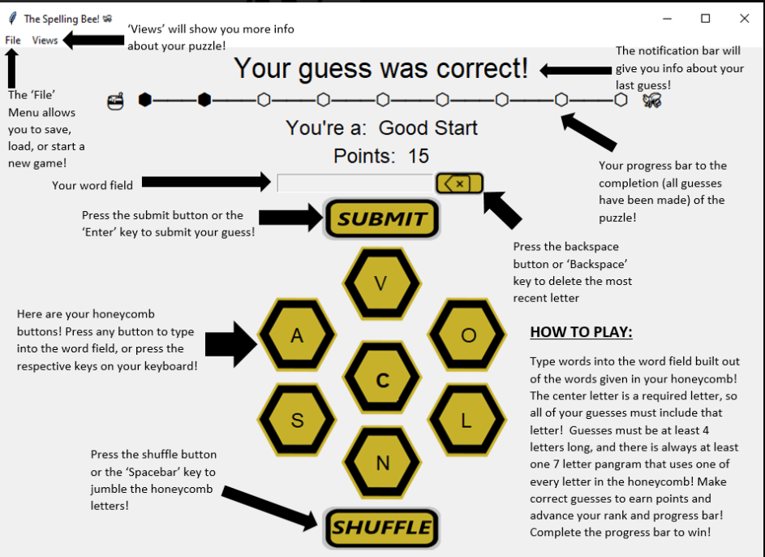

## 2023sp-420-SNEK
## Spelling Bee - SNEK

## Description

    -A Spelling Bee game, implemented in Python with an SQLite database


### Contributers

    -Aitor Cantero Crespo
    -Bogdan Balagurak
    -Josue Perez-Crespo
    -Miguel Armedariz Llanos
    -Nick Hoopes
    -Stephen Clugston

### Neccessary Libraries

    Libraries not pre-packaged with Python
    that need installation.

        -colorama
        -requests
        -numpy
        -pandas
        -pytest

### Python Version

    Tested on Python 3.10.9 and Python 3.11.1


### Instructions for Building using Setup

0. when using windows, execution policy for scripts must be changed
    from default to allow scripts to run like the activate script for the
    virtual environment. This is done by using the command 
    (Set-ExecutionPolicy -ExecutionPolicy RemoteSigned)

1. Creating and entering a virtual environment
    * Creating the environment:
    
        * Linux/Mac:  ```python3 -m venv spell```
        * Windows:  ```py -m venv spell```
        
    * Activating/Entering the environement:
    
        * Linux/Mac:  ```source spell/bin/activate```
        
        * Windows:
            * CMD:  ```spell\Scripts\activate```
            * PowerShell:  ```spell/Scripts/activate```
            
    * Deactivating/Exiting the environment:
    
        * Linux/Mac/PowerShell:  ```deactivate```

2. Building
    * Within the spell environment use the command:  ```pip install -e .```

3. Running program
    * Within the spell environment:
    
        * GUI:   ```Bee```
        * CLI:   ```Bee --cli```


### CLI Instructions

    How to play:
    You are given a word puzzle with a bunch of letters
    and a required letter.  The Required letter is in the
    center of the honeycomb.  Every word that you guess
    requires that the center letter be used, otherwise you
    will not receive credit for the guess.  The word that
    you guess also needs to be a valid word in the
    Scrabble dictionary.  Every puzzle has a corresponding
    pangram that it is generated from.  The pangram will
    include every letter in the honeycomb.

    Commands:
    Call commands with a preceeding '!'. Commands may be
    called at anytime.

            -!new rnd - Generate a new random puzzle
            -!new wrd - Genereate a new puzzle with a user given
                        word.  Console will prompt for the word after
                        command is given.
            -!status - Display you status for the current puzzle.
            -!save - Bring up the prompts for saving your current game.
            -!load - Bring up the prompts for loading a saved game.
            -!shuffle - Shuffle the shown puzzle honeycomb randomly, changing
                        the order of the letter randomly other than the 
                        required center letter.  You can use this to
                        help you find other words.
            -!guessed - Shows all the already correctly guessed words.
            -!help - Prints out the help menu.
            -!exit - Exits the game. Will prompt to save.'''
   
### GUI Instructions



### Testing Suite

* Using the Testing Suite

* Running a complete Test:
    * Use the command line command:  ```Test``` or ```Test all```
        * To add coverage use:  ```Test cov``` or ```Test all cov```

* Testing coverage of a specific directory (IE. model, controller, view)
    * Use the command line command:  ```Test model``` or ```Test controller``` or ```Test view```

* Testing a single unit test/file
    * ```Test single``` for normal testing
    * ```Test single cov``` for testing with coverage
        * Choose the test file via the number connected to them (IE. 1, 2, 3, etc.)
        * If you do not want to choose a file:  ```quit```

* Test command ```Test``` must have uppercase T
        
        
            


### And Remember
    
#  ***`No Step On Snek`*** 

        

